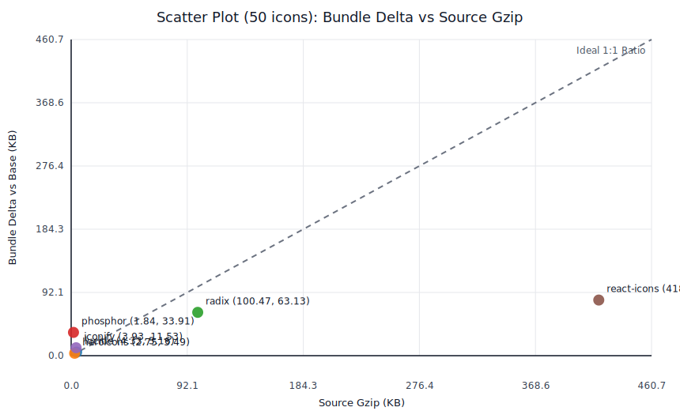
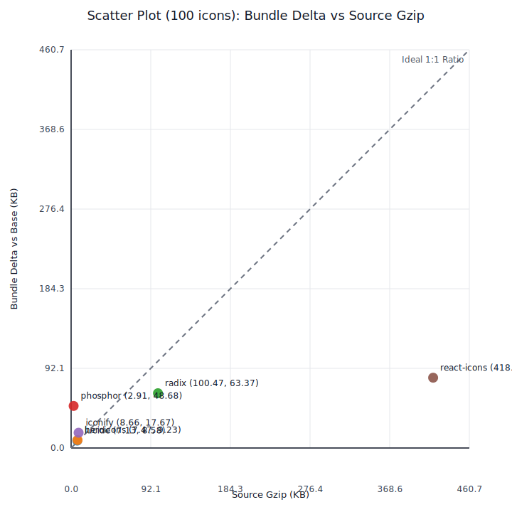
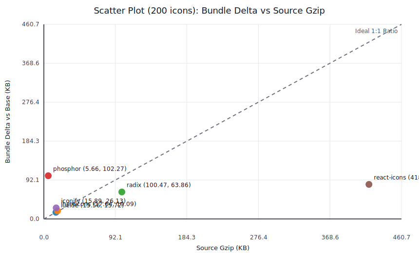

# Benchmark Results

Generated at: 2026-02-20T15:03:26.356Z

Environment:
- Next.js 16.1.6
- React 19.2.3
- Node.js v25.6.1
- Bundler: Turbopack (next build default in this setup)

Method:
- Per count (50/100/200), one route per library with static icon imports in a Client Component
- Baseline route renders same count of non-icon placeholders
- Bundle metric = gzip size of JS chunks referenced by each prerendered route HTML
- Source metric = total raw/gzip size of icon source modules selected by each scenario

### 50 Icons

| Library | Source modules | Source raw (KB) | Source gzip (KB) | Bundle delta vs base (KB) | Delta/icon (B) | Delta/Source(gzip) |
|---|---:|---:|---:|---:|---:|---:|
| lucide | 50 | 34.27 | 4.33 | 5.16 | 105.7 | 1.19x |
| heroicons | 50 | 41.27 | 2.75 | 3.49 | 71.4 | 1.27x |
| radix | 1 | 481.36 | 100.47 | 63.13 | 1292.9 | 0.63x |
| phosphor | 50 | 15.71 | 1.84 | 33.91 | 694.4 | 18.40x |
| iconify | 50 | 20.00 | 3.93 | 11.53 | 236.0 | 2.93x |
| react-icons | 1 | 1333.08 | 418.85 | 81.07 | 1660.2 | 0.19x |



### 100 Icons

| Library | Source modules | Source raw (KB) | Source gzip (KB) | Bundle delta vs base (KB) | Delta/icon (B) | Delta/Source(gzip) |
|---|---:|---:|---:|---:|---:|---:|
| lucide | 100 | 64.43 | 7.13 | 8.58 | 87.9 | 1.20x |
| heroicons | 100 | 88.12 | 7.47 | 9.23 | 94.5 | 1.23x |
| radix | 1 | 481.36 | 100.47 | 63.37 | 649.0 | 0.63x |
| phosphor | 100 | 31.85 | 2.91 | 48.68 | 498.4 | 16.72x |
| iconify | 100 | 41.71 | 8.66 | 17.67 | 181.0 | 2.04x |
| react-icons | 1 | 1333.08 | 418.85 | 81.34 | 832.9 | 0.19x |



### 200 Icons

| Library | Source modules | Source raw (KB) | Source gzip (KB) | Bundle delta vs base (KB) | Delta/icon (B) | Delta/Source(gzip) |
|---|---:|---:|---:|---:|---:|---:|
| lucide | 200 | 133.01 | 15.56 | 15.72 | 80.5 | 1.01x |
| heroicons | 200 | 187.39 | 17.64 | 19.09 | 97.8 | 1.08x |
| radix | 1 | 481.36 | 100.47 | 63.86 | 327.0 | 0.64x |
| phosphor | 200 | 62.75 | 5.66 | 102.27 | 523.6 | 18.06x |
| iconify | 200 | 86.56 | 15.89 | 26.13 | 133.8 | 1.64x |
| react-icons | 1 | 1333.08 | 418.85 | 81.82 | 418.9 | 0.20x |



Raw files by count and route:
```json
{
  "50": {
    "base": {
      "route": "/bench/50/base",
      "iconCount": 50,
      "files": [
        ".next/static/chunks/baab7208d424059e.js",
        ".next/static/chunks/8088942f5b1d57f0.js",
        ".next/static/chunks/9a59ee09d21e98c7.js",
        ".next/static/chunks/b960522c951df4dc.js",
        ".next/static/chunks/turbopack-54d108d4bec72fd3.js",
        ".next/static/chunks/33074d3ff5d0cd2d.js",
        ".next/static/chunks/7afc35baf44adf8a.js",
        ".next/static/chunks/0439026a8cd83b4e.js",
        ".next/static/chunks/a6dad97d9634a72d.js"
      ],
      "bundleGzipBytes": 168265,
      "source": {
        "moduleCount": 0,
        "missingModules": [],
        "rawBytes": 0,
        "gzipBytes": 0
      }
    },
    "lucide": {
      "route": "/bench/50/lucide",
      "iconCount": 50,
      "files": [
        ".next/static/chunks/baab7208d424059e.js",
        ".next/static/chunks/8088942f5b1d57f0.js",
        ".next/static/chunks/9a59ee09d21e98c7.js",
        ".next/static/chunks/b960522c951df4dc.js",
        ".next/static/chunks/turbopack-54d108d4bec72fd3.js",
        ".next/static/chunks/33074d3ff5d0cd2d.js",
        ".next/static/chunks/7afc35baf44adf8a.js",
        ".next/static/chunks/e97a093cae5a8e7f.js",
        ".next/static/chunks/a6dad97d9634a72d.js"
      ],
      "bundleGzipBytes": 173552,
      "source": {
        "moduleCount": 50,
        "missingModules": [],
        "rawBytes": 35095,
        "gzipBytes": 4434
      }
    },
    "heroicons": {
      "route": "/bench/50/heroicons",
      "iconCount": 50,
      "files": [
        ".next/static/chunks/baab7208d424059e.js",
        ".next/static/chunks/8088942f5b1d57f0.js",
        ".next/static/chunks/9a59ee09d21e98c7.js",
        ".next/static/chunks/b960522c951df4dc.js",
        ".next/static/chunks/turbopack-54d108d4bec72fd3.js",
        ".next/static/chunks/33074d3ff5d0cd2d.js",
        ".next/static/chunks/7afc35baf44adf8a.js",
        ".next/static/chunks/aa609f1068fd4f46.js",
        ".next/static/chunks/a6dad97d9634a72d.js"
      ],
      "bundleGzipBytes": 171835,
      "source": {
        "moduleCount": 50,
        "missingModules": [],
        "rawBytes": 42261,
        "gzipBytes": 2811
      }
    },
    "radix": {
      "route": "/bench/50/radix",
      "iconCount": 50,
      "files": [
        ".next/static/chunks/baab7208d424059e.js",
        ".next/static/chunks/8088942f5b1d57f0.js",
        ".next/static/chunks/9a59ee09d21e98c7.js",
        ".next/static/chunks/b960522c951df4dc.js",
        ".next/static/chunks/turbopack-54d108d4bec72fd3.js",
        ".next/static/chunks/33074d3ff5d0cd2d.js",
        ".next/static/chunks/7afc35baf44adf8a.js",
        ".next/static/chunks/8d77b71bf86c0b29.js",
        ".next/static/chunks/00ecc8c197582748.js",
        ".next/static/chunks/a6dad97d9634a72d.js"
      ],
      "bundleGzipBytes": 232909,
      "source": {
        "moduleCount": 1,
        "missingModules": [],
        "rawBytes": 492915,
        "gzipBytes": 102882
      }
    },
    "phosphor": {
      "route": "/bench/50/phosphor",
      "iconCount": 50,
      "files": [
        ".next/static/chunks/baab7208d424059e.js",
        ".next/static/chunks/8088942f5b1d57f0.js",
        ".next/static/chunks/9a59ee09d21e98c7.js",
        ".next/static/chunks/b960522c951df4dc.js",
        ".next/static/chunks/turbopack-54d108d4bec72fd3.js",
        ".next/static/chunks/33074d3ff5d0cd2d.js",
        ".next/static/chunks/7afc35baf44adf8a.js",
        ".next/static/chunks/a520c79ae582c0f4.js",
        ".next/static/chunks/50fd06647daabde3.js",
        ".next/static/chunks/a6dad97d9634a72d.js"
      ],
      "bundleGzipBytes": 202987,
      "source": {
        "moduleCount": 50,
        "missingModules": [],
        "rawBytes": 16082,
        "gzipBytes": 1887
      }
    },
    "iconify": {
      "route": "/bench/50/iconify",
      "iconCount": 50,
      "files": [
        ".next/static/chunks/baab7208d424059e.js",
        ".next/static/chunks/8088942f5b1d57f0.js",
        ".next/static/chunks/9a59ee09d21e98c7.js",
        ".next/static/chunks/b960522c951df4dc.js",
        ".next/static/chunks/turbopack-54d108d4bec72fd3.js",
        ".next/static/chunks/33074d3ff5d0cd2d.js",
        ".next/static/chunks/7afc35baf44adf8a.js",
        ".next/static/chunks/264c197611441d89.js",
        ".next/static/chunks/327f7b0db09f8077.js",
        ".next/static/chunks/a6dad97d9634a72d.js"
      ],
      "bundleGzipBytes": 180067,
      "source": {
        "moduleCount": 50,
        "missingModules": [],
        "rawBytes": 20484,
        "gzipBytes": 4027
      }
    },
    "react-icons": {
      "route": "/bench/50/react-icons",
      "iconCount": 50,
      "files": [
        ".next/static/chunks/baab7208d424059e.js",
        ".next/static/chunks/8088942f5b1d57f0.js",
        ".next/static/chunks/9a59ee09d21e98c7.js",
        ".next/static/chunks/b960522c951df4dc.js",
        ".next/static/chunks/turbopack-54d108d4bec72fd3.js",
        ".next/static/chunks/33074d3ff5d0cd2d.js",
        ".next/static/chunks/7afc35baf44adf8a.js",
        ".next/static/chunks/ae678e46d68ad2d1.js",
        ".next/static/chunks/33c7556f1a184917.js",
        ".next/static/chunks/a6dad97d9634a72d.js"
      ],
      "bundleGzipBytes": 251277,
      "source": {
        "moduleCount": 1,
        "missingModules": [],
        "rawBytes": 1365071,
        "gzipBytes": 428902
      }
    }
  },
  "100": {
    "base": {
      "route": "/bench/100/base",
      "iconCount": 100,
      "files": [
        ".next/static/chunks/baab7208d424059e.js",
        ".next/static/chunks/8088942f5b1d57f0.js",
        ".next/static/chunks/9a59ee09d21e98c7.js",
        ".next/static/chunks/b960522c951df4dc.js",
        ".next/static/chunks/turbopack-54d108d4bec72fd3.js",
        ".next/static/chunks/33074d3ff5d0cd2d.js",
        ".next/static/chunks/7afc35baf44adf8a.js",
        ".next/static/chunks/2c1008dc87949aa0.js",
        ".next/static/chunks/a6dad97d9634a72d.js"
      ],
      "bundleGzipBytes": 168265,
      "source": {
        "moduleCount": 0,
        "missingModules": [],
        "rawBytes": 0,
        "gzipBytes": 0
      }
    },
    "lucide": {
      "route": "/bench/100/lucide",
      "iconCount": 100,
      "files": [
        ".next/static/chunks/baab7208d424059e.js",
        ".next/static/chunks/8088942f5b1d57f0.js",
        ".next/static/chunks/9a59ee09d21e98c7.js",
        ".next/static/chunks/b960522c951df4dc.js",
        ".next/static/chunks/turbopack-54d108d4bec72fd3.js",
        ".next/static/chunks/33074d3ff5d0cd2d.js",
        ".next/static/chunks/7afc35baf44adf8a.js",
        ".next/static/chunks/f4589946a681a579.js",
        ".next/static/chunks/a6dad97d9634a72d.js"
      ],
      "bundleGzipBytes": 177054,
      "source": {
        "moduleCount": 100,
        "missingModules": [],
        "rawBytes": 65978,
        "gzipBytes": 7304
      }
    },
    "heroicons": {
      "route": "/bench/100/heroicons",
      "iconCount": 100,
      "files": [
        ".next/static/chunks/baab7208d424059e.js",
        ".next/static/chunks/8088942f5b1d57f0.js",
        ".next/static/chunks/9a59ee09d21e98c7.js",
        ".next/static/chunks/b960522c951df4dc.js",
        ".next/static/chunks/turbopack-54d108d4bec72fd3.js",
        ".next/static/chunks/33074d3ff5d0cd2d.js",
        ".next/static/chunks/7afc35baf44adf8a.js",
        ".next/static/chunks/46356fdcaf293cbd.js",
        ".next/static/chunks/347d5b7c2d4b1246.js",
        ".next/static/chunks/a6dad97d9634a72d.js"
      ],
      "bundleGzipBytes": 177712,
      "source": {
        "moduleCount": 100,
        "missingModules": [],
        "rawBytes": 90237,
        "gzipBytes": 7651
      }
    },
    "radix": {
      "route": "/bench/100/radix",
      "iconCount": 100,
      "files": [
        ".next/static/chunks/baab7208d424059e.js",
        ".next/static/chunks/8088942f5b1d57f0.js",
        ".next/static/chunks/9a59ee09d21e98c7.js",
        ".next/static/chunks/b960522c951df4dc.js",
        ".next/static/chunks/turbopack-54d108d4bec72fd3.js",
        ".next/static/chunks/33074d3ff5d0cd2d.js",
        ".next/static/chunks/7afc35baf44adf8a.js",
        ".next/static/chunks/a165a03bba32bced.js",
        ".next/static/chunks/00ecc8c197582748.js",
        ".next/static/chunks/a6dad97d9634a72d.js"
      ],
      "bundleGzipBytes": 233160,
      "source": {
        "moduleCount": 1,
        "missingModules": [],
        "rawBytes": 492915,
        "gzipBytes": 102882
      }
    },
    "phosphor": {
      "route": "/bench/100/phosphor",
      "iconCount": 100,
      "files": [
        ".next/static/chunks/baab7208d424059e.js",
        ".next/static/chunks/8088942f5b1d57f0.js",
        ".next/static/chunks/9a59ee09d21e98c7.js",
        ".next/static/chunks/b960522c951df4dc.js",
        ".next/static/chunks/turbopack-54d108d4bec72fd3.js",
        ".next/static/chunks/33074d3ff5d0cd2d.js",
        ".next/static/chunks/7afc35baf44adf8a.js",
        ".next/static/chunks/85e4f775c780e5c5.js",
        ".next/static/chunks/50fd06647daabde3.js",
        ".next/static/chunks/f998d6a3250083c8.js",
        ".next/static/chunks/a6dad97d9634a72d.js"
      ],
      "bundleGzipBytes": 218110,
      "source": {
        "moduleCount": 100,
        "missingModules": [],
        "rawBytes": 32616,
        "gzipBytes": 2982
      }
    },
    "iconify": {
      "route": "/bench/100/iconify",
      "iconCount": 100,
      "files": [
        ".next/static/chunks/baab7208d424059e.js",
        ".next/static/chunks/8088942f5b1d57f0.js",
        ".next/static/chunks/9a59ee09d21e98c7.js",
        ".next/static/chunks/b960522c951df4dc.js",
        ".next/static/chunks/turbopack-54d108d4bec72fd3.js",
        ".next/static/chunks/33074d3ff5d0cd2d.js",
        ".next/static/chunks/7afc35baf44adf8a.js",
        ".next/static/chunks/e1990e68a1251951.js",
        ".next/static/chunks/327f7b0db09f8077.js",
        ".next/static/chunks/a6dad97d9634a72d.js"
      ],
      "bundleGzipBytes": 186364,
      "source": {
        "moduleCount": 100,
        "missingModules": [],
        "rawBytes": 42707,
        "gzipBytes": 8872
      }
    },
    "react-icons": {
      "route": "/bench/100/react-icons",
      "iconCount": 100,
      "files": [
        ".next/static/chunks/baab7208d424059e.js",
        ".next/static/chunks/8088942f5b1d57f0.js",
        ".next/static/chunks/9a59ee09d21e98c7.js",
        ".next/static/chunks/b960522c951df4dc.js",
        ".next/static/chunks/turbopack-54d108d4bec72fd3.js",
        ".next/static/chunks/33074d3ff5d0cd2d.js",
        ".next/static/chunks/7afc35baf44adf8a.js",
        ".next/static/chunks/903aab974eb484e3.js",
        ".next/static/chunks/33c7556f1a184917.js",
        ".next/static/chunks/a6dad97d9634a72d.js"
      ],
      "bundleGzipBytes": 251557,
      "source": {
        "moduleCount": 1,
        "missingModules": [],
        "rawBytes": 1365071,
        "gzipBytes": 428902
      }
    }
  },
  "200": {
    "base": {
      "route": "/bench/200/base",
      "iconCount": 200,
      "files": [
        ".next/static/chunks/baab7208d424059e.js",
        ".next/static/chunks/8088942f5b1d57f0.js",
        ".next/static/chunks/9a59ee09d21e98c7.js",
        ".next/static/chunks/b960522c951df4dc.js",
        ".next/static/chunks/turbopack-54d108d4bec72fd3.js",
        ".next/static/chunks/33074d3ff5d0cd2d.js",
        ".next/static/chunks/7afc35baf44adf8a.js",
        ".next/static/chunks/01a9d945ba2167f2.js",
        ".next/static/chunks/a6dad97d9634a72d.js"
      ],
      "bundleGzipBytes": 168266,
      "source": {
        "moduleCount": 0,
        "missingModules": [],
        "rawBytes": 0,
        "gzipBytes": 0
      }
    },
    "lucide": {
      "route": "/bench/200/lucide",
      "iconCount": 200,
      "files": [
        ".next/static/chunks/baab7208d424059e.js",
        ".next/static/chunks/8088942f5b1d57f0.js",
        ".next/static/chunks/9a59ee09d21e98c7.js",
        ".next/static/chunks/b960522c951df4dc.js",
        ".next/static/chunks/turbopack-54d108d4bec72fd3.js",
        ".next/static/chunks/33074d3ff5d0cd2d.js",
        ".next/static/chunks/7afc35baf44adf8a.js",
        ".next/static/chunks/77009ec058e37470.js",
        ".next/static/chunks/a6dad97d9634a72d.js"
      ],
      "bundleGzipBytes": 184368,
      "source": {
        "moduleCount": 200,
        "missingModules": [],
        "rawBytes": 136204,
        "gzipBytes": 15932
      }
    },
    "heroicons": {
      "route": "/bench/200/heroicons",
      "iconCount": 200,
      "files": [
        ".next/static/chunks/baab7208d424059e.js",
        ".next/static/chunks/8088942f5b1d57f0.js",
        ".next/static/chunks/9a59ee09d21e98c7.js",
        ".next/static/chunks/b960522c951df4dc.js",
        ".next/static/chunks/turbopack-54d108d4bec72fd3.js",
        ".next/static/chunks/33074d3ff5d0cd2d.js",
        ".next/static/chunks/7afc35baf44adf8a.js",
        ".next/static/chunks/347d5b7c2d4b1246.js",
        ".next/static/chunks/f4276d37f4a7dc2e.js",
        ".next/static/chunks/a6dad97d9634a72d.js"
      ],
      "bundleGzipBytes": 187817,
      "source": {
        "moduleCount": 200,
        "missingModules": [],
        "rawBytes": 191890,
        "gzipBytes": 18065
      }
    },
    "radix": {
      "route": "/bench/200/radix",
      "iconCount": 200,
      "files": [
        ".next/static/chunks/baab7208d424059e.js",
        ".next/static/chunks/8088942f5b1d57f0.js",
        ".next/static/chunks/9a59ee09d21e98c7.js",
        ".next/static/chunks/b960522c951df4dc.js",
        ".next/static/chunks/turbopack-54d108d4bec72fd3.js",
        ".next/static/chunks/33074d3ff5d0cd2d.js",
        ".next/static/chunks/7afc35baf44adf8a.js",
        ".next/static/chunks/0574b00055ae3cbd.js",
        ".next/static/chunks/00ecc8c197582748.js",
        ".next/static/chunks/a6dad97d9634a72d.js"
      ],
      "bundleGzipBytes": 233662,
      "source": {
        "moduleCount": 1,
        "missingModules": [],
        "rawBytes": 492915,
        "gzipBytes": 102882
      }
    },
    "phosphor": {
      "route": "/bench/200/phosphor",
      "iconCount": 200,
      "files": [
        ".next/static/chunks/baab7208d424059e.js",
        ".next/static/chunks/8088942f5b1d57f0.js",
        ".next/static/chunks/9a59ee09d21e98c7.js",
        ".next/static/chunks/b960522c951df4dc.js",
        ".next/static/chunks/turbopack-54d108d4bec72fd3.js",
        ".next/static/chunks/33074d3ff5d0cd2d.js",
        ".next/static/chunks/7afc35baf44adf8a.js",
        ".next/static/chunks/f998d6a3250083c8.js",
        ".next/static/chunks/50fd06647daabde3.js",
        ".next/static/chunks/d8a0db04b7e5c71c.js",
        ".next/static/chunks/a6dad97d9634a72d.js"
      ],
      "bundleGzipBytes": 272991,
      "source": {
        "moduleCount": 200,
        "missingModules": [],
        "rawBytes": 64253,
        "gzipBytes": 5800
      }
    },
    "iconify": {
      "route": "/bench/200/iconify",
      "iconCount": 200,
      "files": [
        ".next/static/chunks/baab7208d424059e.js",
        ".next/static/chunks/8088942f5b1d57f0.js",
        ".next/static/chunks/9a59ee09d21e98c7.js",
        ".next/static/chunks/b960522c951df4dc.js",
        ".next/static/chunks/turbopack-54d108d4bec72fd3.js",
        ".next/static/chunks/33074d3ff5d0cd2d.js",
        ".next/static/chunks/7afc35baf44adf8a.js",
        ".next/static/chunks/880faf1839e034cb.js",
        ".next/static/chunks/0bebda9b492f4361.js",
        ".next/static/chunks/327f7b0db09f8077.js",
        ".next/static/chunks/a6dad97d9634a72d.js"
      ],
      "bundleGzipBytes": 195018,
      "source": {
        "moduleCount": 200,
        "missingModules": [],
        "rawBytes": 88639,
        "gzipBytes": 16270
      }
    },
    "react-icons": {
      "route": "/bench/200/react-icons",
      "iconCount": 200,
      "files": [
        ".next/static/chunks/baab7208d424059e.js",
        ".next/static/chunks/8088942f5b1d57f0.js",
        ".next/static/chunks/9a59ee09d21e98c7.js",
        ".next/static/chunks/b960522c951df4dc.js",
        ".next/static/chunks/turbopack-54d108d4bec72fd3.js",
        ".next/static/chunks/33074d3ff5d0cd2d.js",
        ".next/static/chunks/7afc35baf44adf8a.js",
        ".next/static/chunks/855330ba533046d9.js",
        ".next/static/chunks/33c7556f1a184917.js",
        ".next/static/chunks/a6dad97d9634a72d.js"
      ],
      "bundleGzipBytes": 252047,
      "source": {
        "moduleCount": 1,
        "missingModules": [],
        "rawBytes": 1365071,
        "gzipBytes": 428902
      }
    }
  }
}
```
